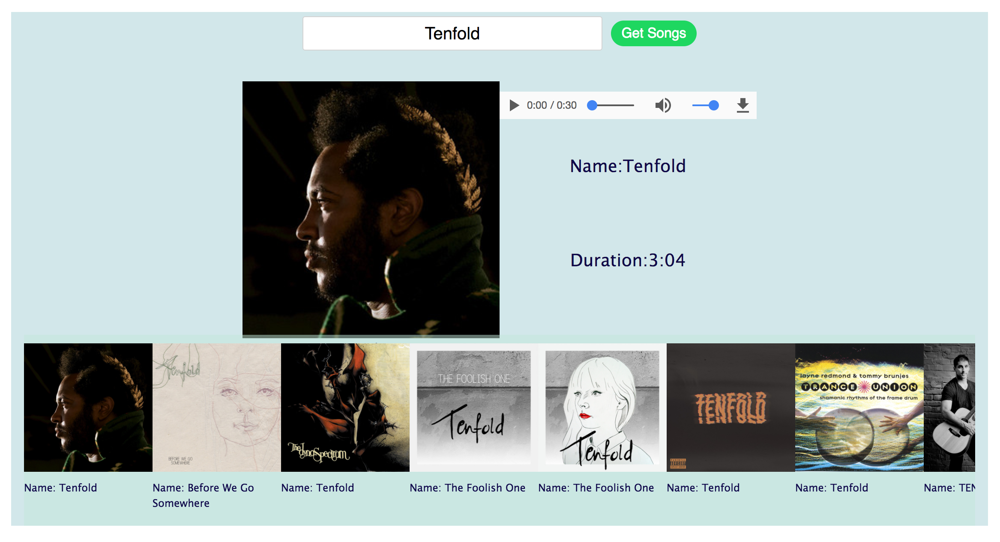

# react-spotify

#### A practice front end app that uses Spotify's API to fetch & play 30 second song snippets. Based on tutorial from [this](https://www.udemy.com/learn-react-the-worlds-most-lucrative-javascript-library/learn/v4/t/lecture/6464284?start=0) Udemy course.

#### Some features/libraries employed:
- React
- axios
- CSS flexbox
